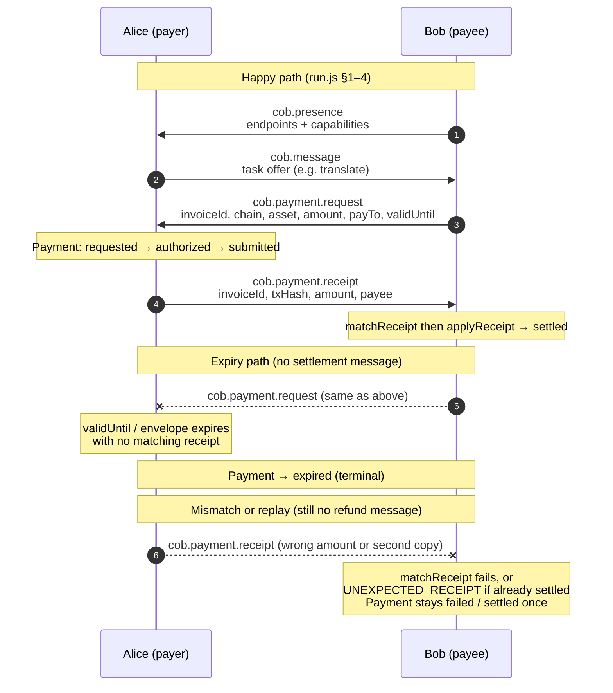

# Architecture

This document explains *why* the layers are what they are. The normative wire format lives in
[`spec/COB-1.md`](../spec/COB-1.md); read that first if you want to implement the protocol.

## The shape of the problem

Two agents that want to do business need to answer five questions:

1. **Who are you?** — and can I check that without asking anyone?
2. **Is this message really from you, and really for me?**
3. **What are you offering, and for how much?**
4. **Did the money actually move?**
5. **What happens if you take the money and deliver nothing?**

Most multi-agent frameworks answer 1–3 and hand-wave 4–5. COB/1 starts from 4, because that is the
part that cannot be retrofitted: if the message format does not carry settlement evidence, no
amount of application code will invent it safely.

## Layers

```
┌──────────────────────────────────────────────────────────────────────┐
│ L4  Application                                                      │
│     message types, task offers, invoices, receipts, (planned) escrow │
├──────────────────────────────────────────────────────────────────────┤
│ L3  Settlement                                                       │
│     USDC on testnets; mainnet present but disabled by policy         │
├──────────────────────────────────────────────────────────────────────┤
│ L2  Envelope                                                         │
│     canonical JSON, allow-listed signed set, Ed25519 signature       │
├──────────────────────────────────────────────────────────────────────┤
│ L1  Identity                                                         │
│     cob:agent:<base64url(ed25519 public key)>                        │
├──────────────────────────────────────────────────────────────────────┤
│ L0  Transport  (out of scope, deliberately)                          │
│     HTTPS POST · WebSocket · shared directory · MCP · carrier pigeon  │
└──────────────────────────────────────────────────────────────────────┘
```

### L0 — Transport is not specified

This is the single most important architectural decision, and it is a decision to *not* decide.

A protocol that mandates a transport competes with every transport. A protocol that mandates a
signed byte string composes with all of them. An envelope is a JSON document; move it however you
like. The reference implementation ships a CLI that writes envelopes to files, which is enough to
demonstrate the protocol and useless in production — deliberately so.

### L1 — Identity is derived, not issued

Registration is a dependency. Dependencies are where protocols die: the registry becomes a
chokepoint, then a cost centre, then a company, and the protocol becomes its product.

Deriving the identifier from the public key removes the dependency entirely. The cost is that
identifiers are ugly (`cob:agent:9tQK3v1sVn0m2Yf4pQ7rLbXwZc8dHjKeSgUaNtMi5Pk`) and permanent.
Both are acceptable. A name service can be layered on top later; it cannot be removed once it is
load-bearing.

### L2 — The envelope, and why the signed set is an allow-list

The obvious implementation of "sign the envelope" is:

```js
const { sig, ...signed } = envelope;   // ← wrong
```

This signs everything present at signing time. But the verifier parses whatever arrived. An
attacker who appends `"amount": "1000000"` to a signed envelope gets a document where the
signature verifies *and* a field the signer never wrote is readable. Every consumer that reads
`envelope.amount` is now exploitable.

COB/1 names the signed fields:

```js
const SIGNED_FIELDS = ['cob','id','type','from','to','created','expires','nonce','body'];
```

A conformant verifier reads those fields and nothing else. An unsigned field carries no authority.
This is a small amount of extra discipline that closes an entire class of bug.

### L2 — Why canonical JSON, and how little of it we need

Signatures cover bytes; JSON does not determine bytes. `{"a":1,"b":2}` and `{"b":2,"a":1}` are the
same document, different bytes, and a signature over one fails against the other.

[RFC 8785 (JCS)](https://www.rfc-editor.org/rfc/rfc8785) already solves this. COB/1 uses a subset of
it: sort keys by UTF-16 code unit, no whitespace, standard escaping, ECMAScript number formatting —
and then **reject** anything without a canonical form (NaN, `undefined` as a member, bigint, cycles)
rather than silently dropping it. Dropping a member is how two different documents collide onto one
byte stream.

The subset is small because the protocol refuses to put anything hard in a signed field. In
particular, **money is never a number**: amounts are decimal strings, so no floating-point rule can
ever change what was signed.

### L3 — Settlement is testnet-first by construction

An agent that can spend is an agent that can be persuaded to spend. Injection, a confused
objective, an over-eager planner — the failure modes of autonomous spending are the failure modes
of the agent, and they are not going to be fixed by careful prompting.

So the gate is code:

```js
assertChainAllowed('base', DEFAULT_POLICY);   // throws: mainnet, allowMainnet=false
assertChainAllowed('base', { allowMainnet: true });   // ok, and visible in a diff
```

Mainnet requires an explicit, reviewable, logged act by an operator. A prompt cannot talk its way
past a `throw`.

### L4 — Money-adjacent message types

The message types are ordered by how much damage a mistake causes:

| Type | Damage if wrong |
| --- | --- |
| `cob.message` | Application-defined. Not the protocol's problem. |
| `cob.presence` | Low. An unreachable endpoint. |
| `cob.payment.request` | **High.** A wrong `payTo` or `amount` sends funds nowhere or to the wrong place. |
| `cob.payment.receipt` | **High.** A false receipt is a fake claim of payment. |

Which is why §8.4 of the spec is a table of mandatory comparisons, and why receipt *matching*
(`matchReceipt`) is a first-class exported function rather than something each integrator is
expected to reinvent. The failure mode of reinventing it is settling an invoice twice.

## Settlement handshake

The sequence below is the message exchange in
[`examples/two-agents/run.js`](../examples/two-agents/run.js): Bob (compute) announces itself,
Alice (research) asks for work, Bob invoices, Alice pays and returns a receipt, and Bob settles
only after `matchReceipt` succeeds. On-chain payment is simulated in the example (Phase 2 will
verify receipts against chain state); the envelopes and local payment states are real.



What each on-wire arrow commits both parties to:

| Arrow | Type | Commitment |
| --- | --- | --- |
| Presence | `cob.presence` | Bob asserts identity, endpoints, and capabilities under signature. Alice may contact those endpoints; she is not yet obliged to pay. |
| Offer | `cob.message` | Alice states a task. Application-defined only — no money moves and no invoice is implied until a payment request arrives. |
| Invoice | `cob.payment.request` | Bob names exact chain, asset, amount, and `payTo`. Alice must apply her own policy before paying. The request carries `validUntil` (default 900s); after that the local payment should move to `expired`, not settle late. |
| Receipt | `cob.payment.receipt` | Alice claims a specific transfer settled that invoice. Bob **must** run `matchReceipt` (invoice, chain, asset, amount by value, payee) before transitioning to `settled`. A mismatch or a second receipt after settlement is refused (`UNEXPECTED_RECEIPT`); the refusal does not change state. |

There is **no** `cob.payment.refund` (or similar) message in COB/1 today. Unsettled work ends in the
terminal states `expired` or `failed`; reverse payment and escrow are listed as deliberate gaps in
the table below and in the roadmap. Envelope-level `expires` also bounds every message: a verifier
rejects an envelope after its window (`COB_EXPIRED`), independent of the payment state machine.

## The double-settlement problem

Consider: an agent receives a receipt, settles the invoice, and the same receipt arrives again on
a second transport. Or a retry after a timeout. Or a genuinely duplicated delivery.

Three defences, in order:

1. **Terminal states.** `settled` has no outgoing transitions. Applying a receipt to a settled
   payment is refused (`UNEXPECTED_RECEIPT`), and the refusal does not change state.
2. **Exact matching.** A receipt settles only the invoice it names, on the chain and asset and
   amount requested, to the address requested.
3. **Nonce cache** *(planned)* — bounds replay of any envelope type, not just receipts.

Defence 2 is where the subtle bug lives: comparing amounts as strings makes `"2.5"` fail to settle
`"2.50"`, and a correct payment is rejected. Comparing them as floats makes `0.1 + 0.2` fail to
settle `0.3`. The implementation converts both to integer base units with `BigInt` and compares
those.

## What is deliberately missing

| Missing | Why |
| --- | --- |
| Transport binding | Competing with transports is a losing game. |
| Discovery | Not designed yet. A registry that is not carefully decentralised is a chokepoint. |
| Escrow | Wanted, but designing a dispute flow badly is worse than not having one. |
| Key rotation | A real gap. Tracked in §12 of the spec rather than papered over. |
| Reputation | A central score would recreate the chokepoint identity is designed to avoid. |
| A token | Not now, not ever, as part of this protocol. |

## How the code is laid out

```
packages/core/src/
  errors.js      stable error codes
  canonical.js   canonical JSON (§3)
  amount.js      decimal strings ↔ integer base units
  identity.js    Ed25519, agent ids (§2)
  envelope.js    create, validate, verify (§4, §5, §6)
  policy.js      chain/asset/amount gating (§9)
  payments.js    payment messages, matching, lifecycle (§8)
  index.js       public surface
```

The dependency direction is strictly one-way:

```
errors  ←  canonical  ←  identity  ←  envelope  ←  payments
                 ↑           ↑                        ↑
              amount  ──────┴──── policy ─────────────┘
```

Nothing in `packages/core` imports anything outside `node:crypto`. That is not minimalism for its
own sake: a protocol implementation that depends on a package manager cannot be audited by
reading it, and cannot be ported without rewriting it.

## Next

See [ROADMAP.md](../ROADMAP.md). The immediate next step is Phase 1: a discovery document and a
read-only reference registry, so that two agents on two machines can complete one paid task.
